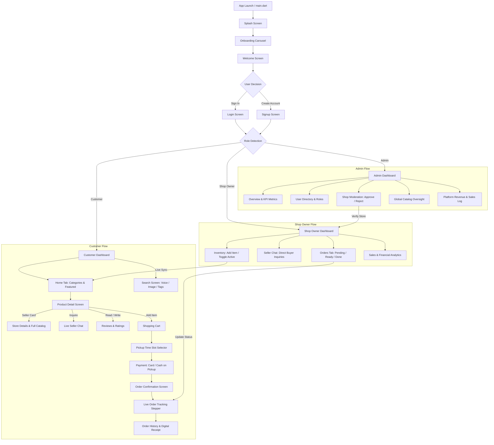

# 🛒 DashGrocer — Hyperlocal Grocery Pre-Order & In-Store Pickup App

[](https://flutter.dev)
[](https://dart.dev)
[](https://firebase.google.com)
[](#)
[](#)
[](https://opensource.org/licenses/MIT)

A modern, full-stack, enterprise-grade hyperlocal grocery pre-ordering and zero-wait in-store pickup application. Built with **Flutter**, **Firebase Cloud Firestore**, and **Clean Role-Based Architecture (RBAC)** supporting **Customers**, **Shop Owners**, and **Super Admins**.

---

## 📋 Table of Contents
- [✨ Key Features by Role](#-key-features-by-role)
- [🔄 Complete Application Flow](#-complete-application-flow)
- [🏗️ System Architecture & Directory Structure](#️-system-architecture--directory-structure)
- [🔑 Pre-Configured Test Credentials](#-pre-configured-test-credentials)
- [🚀 Quick Start (Install & Run)](#-quick-start-install--run)
- [🧪 Automated Test Suite (154 Tests)](#-automated-test-suite-154-tests)
- [🛡️ Security & Validations](#️-security--validations)
- [📄 License](#-license)

---

## ✨ Key Features by Role

### 👤 1. Customer Experience
* **Cinematic Onboarding & Welcome:** High-definition hero splash, feature tour onboarding carousel, and streamlined entry.
* **Smart Authentication:** Clean email & password login/registration with live Sri Lankan phone number validation (`🇱🇰 +94`) and interactive password strength meter.
* **Curated Grocery Catalog:** Rich catalog with categories (Vegetables, Fruits, Meat & Fish, Bakery, Dairy) featuring transparent HD imagery, verified pricing in Sri Lankan Rupees (`Rs.`), and nutritional breakdown badges (Vitamin A, Lycopene, Quercetin, Beta-Carotene).
* **Search & Discovery Engine:** Real-time keyword filtering, search history tags, suggested keywords, voice search simulation, and image barcode/product search.
* **Verified Seller Credentials & Store Profile:** Product cards link directly to the seller's store profile, displaying verified badges, store ratings, physical address, opening hours, one-tap phone dialer, and entire in-store stock catalog.
* **Real-Time 1-on-1 Seller Chat:** Context-aware live messaging linked directly to the inquired item, quick-question recommendation chips, live typing indicators, and message timestamps.
* **Interactive Reviews & Ratings:** Star-rating breakdown histogram, verified shopper badges, and an interactive review submission form.
* **Pickup Scheduler & Cart:** Live item quantity steppers, subtotal & fee breakdown, promo code support, and scheduled in-store pickup slot picker (e.g., Today 4:30 PM).
* **Flexible Payments & Saved Cards:** Support for Cash on Pickup and Credit/Debit cards with animated card preview, CVV/Expiry validation, and saved wallet management.
* **Live Order Tracking Stepper:** Step-by-step visual tracker (Order Placed ➔ Confirmed ➔ Packing ➔ Ready for Pickup ➔ Completed) with real-time status updates.
* **Order History & Quick Re-order:** Searchable past orders list by Order ID or store name, digital receipts, and one-tap re-order capability.
* **Favorites & Customer Notifications:** Quick wishlist toggle for frequent items, badge counts, and instant notification alerts.

---

### 🏪 2. Shop Owner / Seller Dashboard
* **Dynamic Seller Onboarding:** Multi-role signup capturing Store Name and Pickup Address with admin approval status indicators.
* **Live Orders Management Hub:** Filter orders by status (*Pending, Packing, Ready for Pickup, Completed*), inspect ordered items, view customer pickup time slots, and advance order state with one tap.
* **Direct Buyer Inquiries (Seller Chat Hub):** Unified inbox of all customer conversations, complete with product preview thumbnails and unread notification indicators.
* **Catalog & Inventory Control:**
  * Add custom products with high-resolution imagery, stock quantity, and pricing.
  * 1-Tap preset creation for authentic local vegetables (Fresh Pumpkin, Ripe Tomatoes, Red Onions, etc.).
  * Real-time Active/Inactive inventory switch to instantly show or hide out-of-stock items across the entire app.
  * In-place price and stock adjustment with instant customer-facing reflection.
* **Business Analytics & Revenue:** Today, 7-day, and 30-day revenue summaries, order volume counters, and average order value metrics.
* **Store Alerts & Notifications:** Sound and badge notifications alerting the owner to new customer pickup requests and buyer messages.

---

### 🛡️ 3. Super Admin Panel
* **Comprehensive Metrics Overview:** Global platform key performance indicators (Total Revenue, Total Active Users, Registered Stores, and Live Orders).
* **Store Moderation & Verification:** Review pending seller applications, inspect store pickup addresses, and Approve or Reject vendor licenses.
* **User Management:** Full directory of Customer, Seller, and Admin accounts with active session monitoring and role permissions.
* **Catalog Oversight:** Global inventory audit across all shops, pricing compliance, and product availability monitoring.
* **Platform-Wide Transaction Reporting:** Multi-shop order search, timeline filters (*Today, 7 Days, 30 Days, All Time*), and order status tracking.

---

## 🔄 Complete Application Flow



---

## 🏗️ System Architecture & Directory Structure

DashGrocer follows a **Clean, Service-Oriented Architecture** with strict Role-Based Access Control (RBAC) and reactive state management:

```
lib/
├── core/
│   ├── formatters.dart          # Currency & date formatting utilities
│   ├── phone_validator.dart     # Sri Lanka (+94) phone formatting & validation
│   └── theme/
│       ├── app_colors.dart      # Curated emerald brand palette & neutral shades
│       └── app_theme.dart       # Modern ThemeData, Plus Jakarta Sans typography
├── models/
│   ├── chat_message_model.dart  # 1-on-1 customer-seller message data model
│   ├── grocery_item_model.dart  # Product metadata, nutrition, and store link
│   ├── owner_profile.dart       # Shop owner details and verification status
│   ├── product.dart             # Item schema with inventory & Firestore mapping
│   ├── saved_card.dart          # Tokenized payment card wallet model
│   ├── seller_order_model.dart  # In-store pickup order & stepper stages
│   ├── shop_profile.dart        # Store hours, address, ratings, telephone
│   └── user_model.dart          # RBAC User profile (Customer, ShopOwner, Admin)
├── services/
│   ├── auth_service.dart        # Session state, RBAC routing & user streams
│   ├── card_service.dart        # Secure card storage & default selector
│   ├── chat_service.dart        # Real-time reactive customer-seller messaging
│   ├── database_seeder.dart     # Demo catalog and initial accounts seeder
│   └── grocery_service.dart     # Firestore-synchronized live store & cart engine
└── views/
    ├── admin/
    │   └── admin_dashboard.dart # 5-Tab moderation, analytics & user directory
    ├── auth/
    │   ├── auth_screen.dart     # Top-level auth state switcher
    │   ├── splash_screen.dart   # Animated branding splash
    │   ├── onboarding_screen.dart # Multi-slide feature introduction
    │   ├── welcome_screen.dart  # Welcome banner & direct entry
    │   ├── login_screen.dart    # Role switcher, email/password entry
    │   ├── signup_screen.dart   # SL phone validation & dynamic store fields
    │   └── forgot_password_flow.dart # 3-step OTP password recovery flow
    ├── common/
    │   └── app_image_view.dart  # Transparent caching image handler
    ├── customer/
    │   ├── customer_dashboard.dart   # Bottom navigation root
    │   ├── customer_home_tab.dart    # Category grid & promotional banners
    │   ├── search_screen.dart        # Keyword, voice, and image discovery
    │   ├── product_detail_screen.dart # Nutrition badges, seller card, reviews
    │   ├── store_details_screen.dart # Store credentials, phone call, catalog
    │   ├── seller_chat_screen.dart   # Contextual product-linked live chat
    │   ├── reviews_screen.dart       # Rating histogram & feedback list
    │   ├── write_review_screen.dart  # Interactive rating submission
    │   ├── cart_screen.dart          # Item quantity steppers & promo discount
    │   ├── pickup_time_screen.dart   # Date & time slot picker
    │   ├── payment_screen.dart       # Card/Cash selection & animated preview
    │   ├── add_card_screen.dart      # Credit/Debit card form with luhn check
    │   ├── my_cards_screen.dart      # Saved cards management
    │   ├── order_confirmation_screen.dart # Order success illustration & ID
    │   ├── track_order_screen.dart   # Vertical 5-step order progress stepper
    │   ├── order_history_screen.dart # Past orders with search & re-order
    │   ├── customer_notifications_sheet.dart # Order alerts bottom sheet
    │   ├── favorites_tab.dart        # Quick-access saved products
    │   └── profile_tab.dart          # Personal details, phone, dark mode
    └── shop_owner/
        ├── shop_owner_home.dart      # Seller shell & navigation
        ├── shop_owner_dashboard.dart # Main seller dashboard
        ├── orders/                   # Order cards, filter chips, order details
        ├── products/                 # Active/Inactive toggle, price/stock edit
        ├── chat/                     # Buyer conversation list & live chat screen
        ├── sales/                    # Revenue breakdown & performance charts
        └── add_product_screen.dart   # Vegetable presets & custom item creation
```

---

## 🔑 Pre-Configured Test Credentials

Instant one-click access is available for all three user roles:

| Role | Email | Password | Primary Capabilities to Test |
| :--- | :--- | :--- | :--- |
| **Customer** | `customer@dashgrocer.com` | `Password123!` | Browse produce, seller chat, add to cart, select pickup slot, pay by card/cash, track order stepper |
| **Shop Owner** | `seller@dashgrocer.com` | `Password123!` | Receive pickup orders, mark ready, live chat with customers, toggle product availability, view revenue |
| **Super Admin** | `admin@dashgrocer.com` | `Password123!` | Approve/reject seller shops, manage platform accounts, inspect catalog, view multi-store sales analytics |

*(You can also use **"Sign Up"** to create a fresh Customer or Shop Owner account with custom store details at any time).*

---

## 🚀 Quick Start (Install & Run)

### 1. Prerequisites
- [Flutter SDK](https://docs.flutter.dev/get-started/install) (`v3.24` or later)
- [Dart SDK](https://dart.dev/get-dart) (`v3.0` or later)
- [Git](https://git-scm.com)
- Any target device: Android emulator, physical phone, Chrome browser, or Windows desktop.

### 2. Clone the Repository
```bash
git clone https://github.com/Akila-Liyanage/DashGrocer.git
cd DashGrocer
```

### 3. Install Dependencies
```bash
flutter pub get
```

### 4. Run the Application
```bash
# Run on your default connected device / emulator:
flutter run

# Or launch on Google Chrome (Web):
flutter run -d chrome

# Or launch on Windows Desktop:
flutter run -d windows
```

> **VS Code Users:** Simply open the workspace, select the device in the bottom toolbar, and press **`F5`** to launch debugging directly via `.vscode/launch.json`.

---

## 🧪 Automated Test Suite (154 Tests)

The repository includes a comprehensive automated test suite covering unit logic, widget rendering, role switching, multi-view synchronization, and end-to-end checkout flows:

```bash
flutter test
```

### Test Coverage Summary:
* **`complete_app_flow_test.dart`:** End-to-end journey from browsing to cart checkout, scheduled pickup selection, and live order reflection.
* **`figma_screens_test.dart`:** High-fidelity layout and widget tests matching the design system (Home, Product Detail, Category, Cart, Search, Pickup, Payment, Tracking, Store Details, Reviews, Notifications).
* **`seller_dashboard_test.dart`:** Multi-tab seller navigation (*Orders, Products, Analytics*), add product modal, and metrics.
* **`seller_item_sync_test.dart`:** Real-time synchronization when a seller modifies or creates an item: verifies instant reflection on Customer Home and Admin inspection sheets.
* **`seller_product_lifecycle_test.dart`:** Complete lifecycle verification: activating, inactivating, price updating, and customer visibility filtering.
* **`shop_owner_chat_test.dart`:** Real-time messaging engine, quick-reply chips, and message deduplication.
* **`multi_customer_chat_test.dart`:** Multi-user concurrent conversation handling between distinct customers and sellers.
* **`seller_chat_test.dart`:** Seller profile card, direct telephone launcher, and contextual product badges.
* **`store_details_test.dart`:** Store credentials, opening hours, verified status, and browsing in-store stock.
* **`payment_screen_test.dart`:** Credit/Debit card form validation, saved cards wallet, and Cash on Pickup flow.
* **`write_review_test.dart`:** Star rating selection, comment validation, and customer review publication.
* **`order_history_search_test.dart`:** Search and filtering of past purchases by Order ID and store name.
* **`phone_validation_test.dart`:** Sri Lankan phone number formatters (`+94 XX XXX XXXX`), 9/10-digit validation, and country code prefix badge.
* **`admin_panel_test.dart`:** Store moderation workflow (Approve/Reject shops), user directory filtering, and financial metrics.
* **`customer_notifications_test.dart`:** Order status alerts, unread counters, and mark-as-read actions.
* **`widget_test.dart`:** Role-based access control, login validation, caps lock indicators, and navigation guards.

---

## 🛡️ Security & Validations

* **Role-Based Guards (RBAC):** `AuthRoleWrapper` strictly evaluates user authentication and role type before routing to Customer, Seller, or Admin views.
* **Sri Lanka Phone Validation (`+94`):** Built-in `SriLankaPhoneInputFormatter` formats input automatically to the national standard and validates 9-digit mobile lines.
* **Password Strength Algorithm:** Real-time evaluation verifying length, numbers, and special characters with animated visual meter indicators.
* **Non-Blocking Background Seeder:** Initial sample catalog and verified vendor profiles populate seamlessly in the background without UI thread freeze.

---

## 📄 License
This project is open-source and available under the [MIT License](LICENSE) — feel free to customize, extend, and build upon it!
